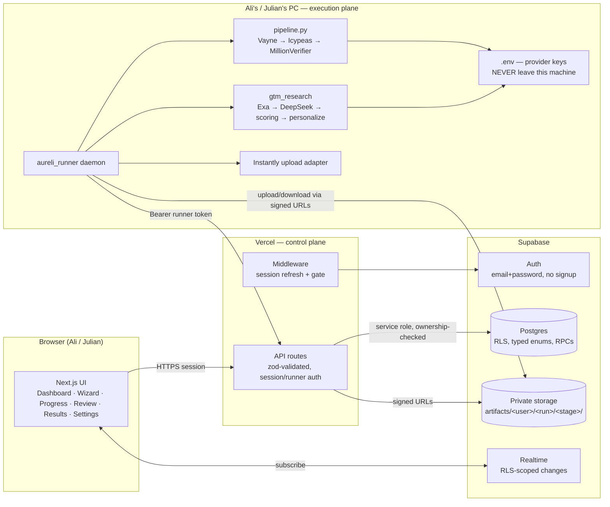
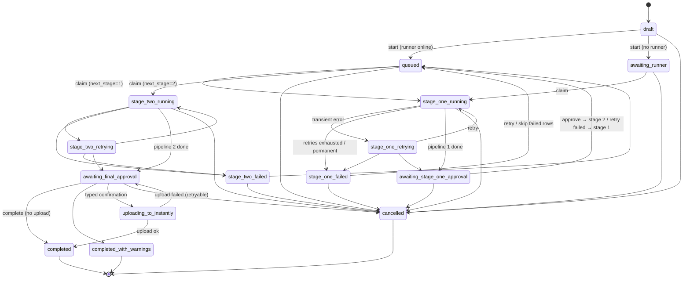

# Architecture

## Components

## Run state machine

Enforced in three places that must agree (tests pin all three): the
`run_status` Postgres enum, `packages/shared/src/stateMachine.ts` (every
server-side transition), and `runner/aureli_runner/protocol.py` (generated).

## Key flows

**Job claim** — `claim_next_job` RPC: looks up the runner by token hash,
selects the oldest claimable run **of that runner's user** with
`FOR UPDATE SKIP LOCKED`, pins `claimed_by`, flips status, and upserts the
stage row — one atomic transaction, so two runners can never double-claim.

**Events** — the runner assigns a monotonic `seq` per run and batches events;
`append_run_events` inserts with `ON CONFLICT (run_id, seq) DO NOTHING`,
updates the denormalized progress blob, and trims Postgres to the newest 500
events (the full log ships as a storage artifact). Browser gets Supabase
Realtime with a 5s polling fallback.

**Approvals** — stage completion never advances past a checkpoint: the server
sets `awaiting_stage_one_approval` / `awaiting_final_approval` and creates an
`approval_requests` row. Only an authenticated owner decision moves the run
on. Instantly uploads additionally require re-typing the campaign title and
lead count and are idempotent end-to-end (UNIQUE(run_id) + idempotency key +
per-lead skip-duplicate flags).

**Recovery** — browser closure is irrelevant (state lives server-side).
Runner/PC restarts: local `state.json` checkpoints + `find_incomplete_runs()`
+ claim-with-`resume_run_id` re-attach the device to its in-flight run, and
pipeline-native resume (MV progress CSV, Vayne order reuse, Icypeas batch
dedup, GTM per-company checkpoints) guarantees paid work is never repeated.

## Protocol versioning

`packages/shared/protocol.json` is the single source of truth
(`protocol_version` 1.0.0). `npm run protocol:generate` emits the TS and
Python modules; `npm run protocol:check` + tests in both languages fail on
drift. Every runner request carries its protocol version; pairing and claim
reject incompatible versions, and heartbeats surface a warning banner on the
Runners page.
